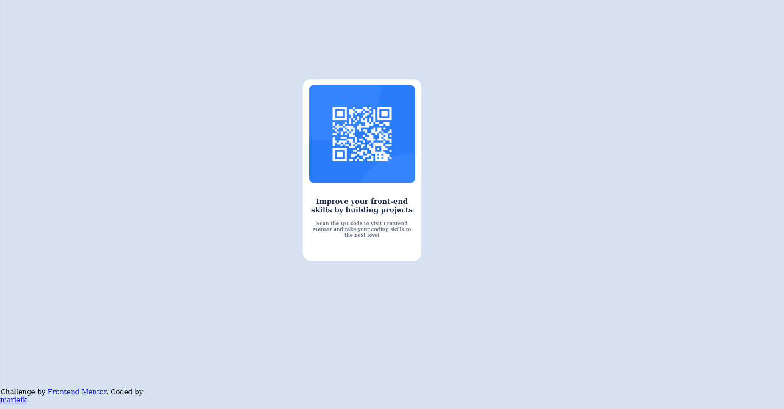

# Frontend Mentor - QR code component

## Table of contents

- [Overview](#overview)
  - [Screenshot](#screenshot)
  - [Links](#links)
- [My process](#my-process)
  - [Built with](#built-with)
  - [What I learned](#what-i-learned)
  - [Continued development](#continued-development)
  - [Useful resources](#useful-resources)
- [Author](#author)

## Overview

This report provides an overview of a simple web page created using HTML and CSS. The project showcases basic web development skills and design principles.

### Screenshot

### Links

- Solution URL: [Ma solution](https://github.com/Mariekaf/QR_code_simple_template.git)

## My process

### Built with
For this project, I utilized:
- **HTML**: To structure the content of the web page, defining elements such as headings, paragraphs, images, and links.
- **CSS**: To style the web page, including layout, colors, fonts, and responsiveness.

### What I Learned
Throughout this project, I gained several key insights:
- **HTML Structure**: Understanding the importance of semantic HTML and how to use various tags effectively.
- **CSS Styling**: Learning to apply styles to elements and the use of classes and IDs to target specific elements.
- **Debugging**: Identifying and fixing layout issues, which improved my problem-solving skills.

## Author

- Website - [Mariekaff](https://github.com/Mariekaf/QR_code_simple_template.git)
- Frontend Mentor - [mariefk](https://www.frontendmentor.io/profile/Mariekaf)

